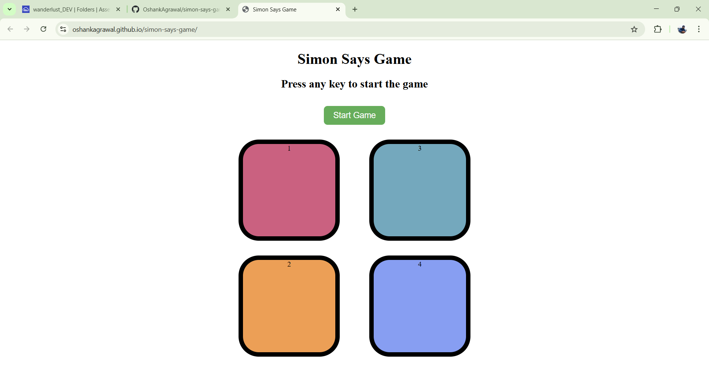

<h1 align="center"> 🎮 Simon Says – Interactive Memory Game</h1>

  

    A fun and challenging browser-based <b>Simon Says</b> memory game, where you test your memory by repeating sequences of colors. 
    Built with <b>HTML</b>, <b>CSS</b>, and <b>JavaScript</b>, and deployed using <b>GitHub Pages</b>. 
    Test your memory skills, beat your own high score, and enjoy this timeless classic — all in your browsers on mobile phones, desktops, and laptops.

---

## 🚀 Live Demo [Play the Game Here](https://oshankagrawal.github.io/simon-says-game/)

---

## 📌 Features
- 🎯 **Simple & Fun** – Classic Simon Says gameplay.
- 💡 **Visual Feedback** – Buttons flash for both game sequence and player clicks.
- 🏆 **Session High Score Tracking** – Try to beat your own best score for the current session.
- 📱 **Responsive Design** – Play on desktop or mobile.

---

## 🕹️ How to Play
1. **Start the Game** – Press any key to begin or click on `Start Game` button.
2. **Watch the Sequence** – The game will flash a sequence of colors.
3. **Repeat the Sequence** – Click the buttons in the same order.
4. **Level Up** – Each round, the sequence gets longer.
5. **Game Over** – Miss a step, and your score is displayed.

---

## 📂 Project Structure
📦 simon-says-game  
┣ 📜 index.html # Main HTML file  
┣ 📜 style.css # Styling for the game  
┣ 📜 app.js # Game logic in JavaScript  
┗ 📂 assets/ # Images or icons

---

## 🛠️ Built With
- **HTML5** – Structure
- **CSS3** – Styling & animations
- **JavaScript (ES6)** – Game logic

---

## 📸 Screenshot

---

## 🏷️ Topics
`game` `javascript` `html` `css` `simon-says` `memory-game` `web-game` `frontend` `browser-game` `interactive`

---

## 📜 License
This project is licensed under the [MIT License](LICENSE) – feel free to use, modify, and share with credit.

---

## 👨‍💻 Author

**Oshank Agrawal**
*Developer, Problem Solver, Tech Enthusiast*
🔗 [LinkedIn](https://www.linkedin.com/in/oshankagrawal/) • 📧 [oshankagrawal@example.com](mailto:oshankagrawal@example.com)

